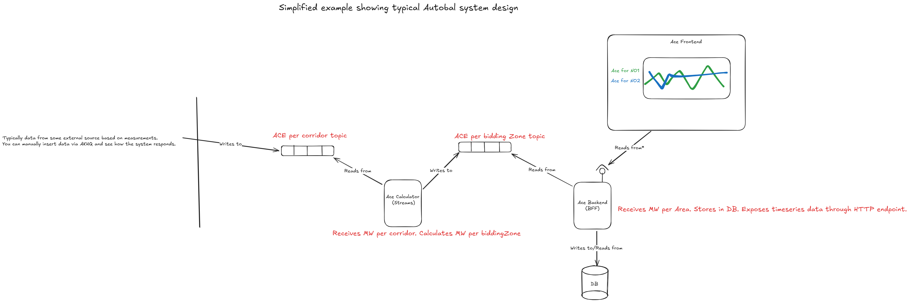

# Ace example 
This repo runs a simplified example for calculating ACE per bidding zone based on input data for ACE per corridor.
The purpose is to show how a typical value-chain can be developed with Kafka and Java Streams app(s). 



# Public Services

- **AKHQ (Kafka UI)**: https://kafka-hq.wittyshizard.dev
- **ACE Backend API**: https://ace-backend.wittyshizard.dev
- **Webapp Frontend**: https://ace-web.wittyshizard.dev/

Try it out!

Go to ace-corridor topic and publish a message on this format.

### Example ace corridor message. NO1, NO2, NO3, NO4 and NO5 are valid in/out areas

```json
[
  {
    "OutArea": "NO1",
    "InArea": "NO2",
    "Quantity": 100,
    "TimeStamp": "2025-09-22T06:00:00Z"
  },
  {
    "OutArea": "NO1",
    "InArea": "NO2",
    "Quantity": 50,
    "TimeStamp": "2025-09-22T06:15:00Z"
  },
  {
    "OutArea": "NO3",
    "InArea": "NO2",
    "Quantity": 100,
    "TimeStamp": "2025-09-22T06:00:00Z"
  },
  {
    "OutArea": "NO3",
    "InArea": "NO2",
    "Quantity": 50,
    "TimeStamp": "2025-09-22T06:15:00Z"
  }
]
